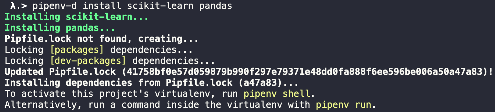
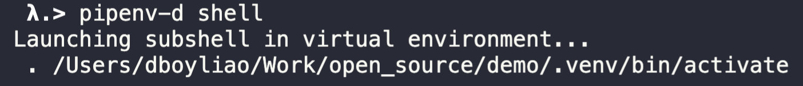

# `pipenv-d`: A `d`irty hack of `pipenv`

`pipenv-d` is a dirty hack of [`pipenv`](https://pipenv.pypa.io/en/latest/).

TL;DR, I want [this feature](https://github.com/pypa/pipenv/issues/5130), `pipenv` can support multiple platform-specific lock file.

Why? Because some of my colleagues are using `x86_64` machine and some are using Apple silicon (such as `m1`). As a result, when some of them lock dependencies on one machine, high chances is that the lock file may not work on the other, especially for machine learning applications whcih rely on extension modules (`Cython`, `pybind11`, `Numba`..etc) heavily which are very platform-specific.

I am just so tired of fixing such dependency issues for them. I NEED platform-specific lock file support ASAP.

## Installation

- via `pip`
```bash
$ python3 -m pip install pipenv-d
```

## Usage

Simple, whenever you want to run `pipenv` in the console, replace it with `pipenv-d`.

`pipenv-d` works exactly the same as `pipenv` except that it will create platform-specific lock file in your project instead of single `Pipfile.lock`.

## Demo

- install packages in your project with `pipenv-d`


- platform-specific lock file will be generated in `.pipenv.d/`


- To regenerate the virtual environment, simply run `pipenv-d install` again, just like what you would do with `pipenv`.



## How it works?

Simple, everytime `pipenv` generate a `Pipfile.lock`, move it to `.pipenv.d` directory and give it a platform-specific name.

If any platform-specific-named lock file found in `.pipenv.d` when `pipenv-d` is executed, copy the content to `Pipfile.lock` in the working directory and invoke `pipenv` command afterward.

After `pipenv` exits, move `Pipfile.lock` back to `.pipenv.d`.